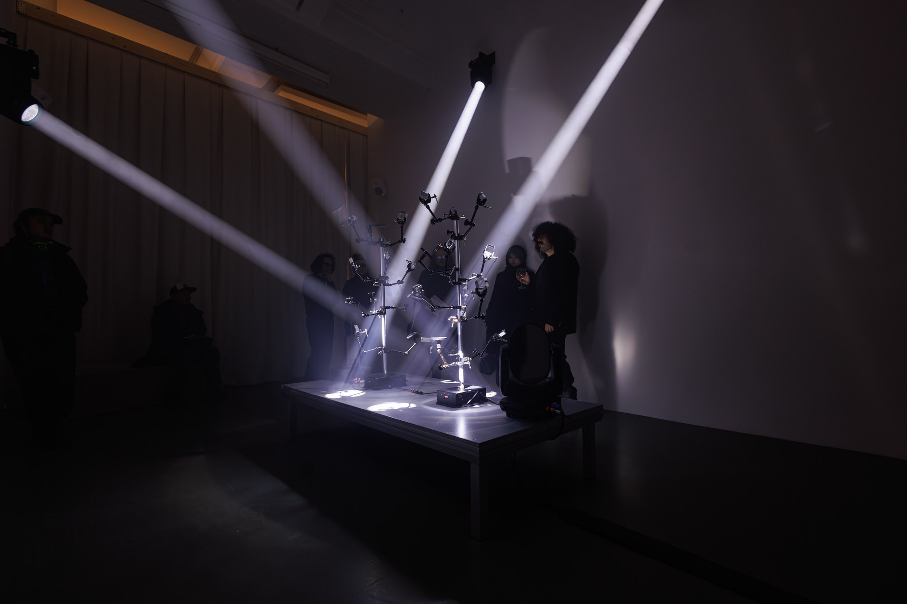
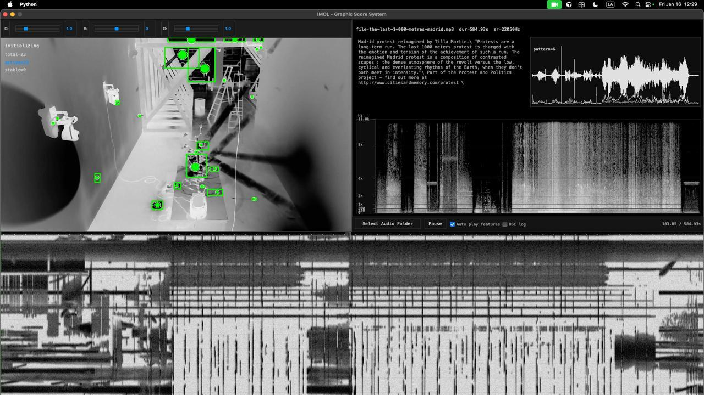
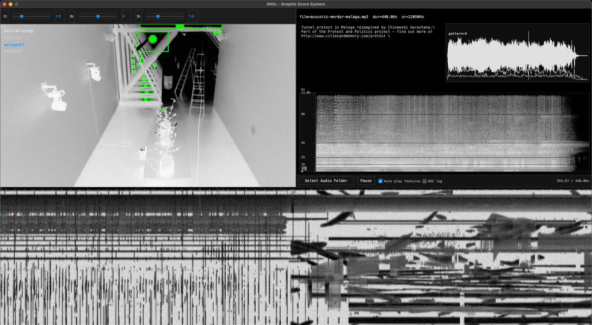
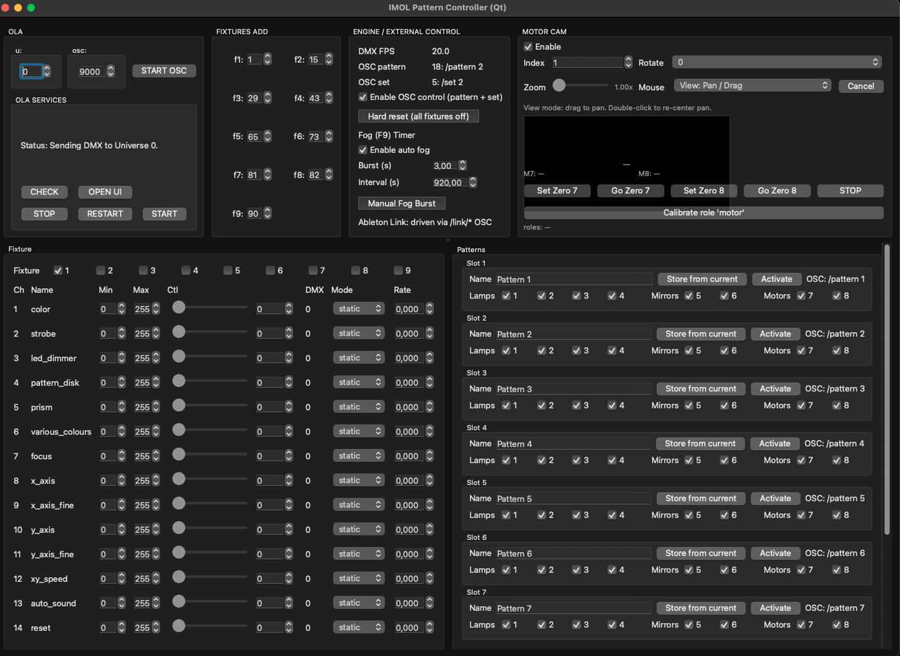

# An Instrument Made of Light



Light-based instrument and graphic score by **Interspecifics**
A/V Installation -- 2026

[Watch the video](https://vimeo.com/1170260167)

---

## Concept

In this new project, Interspecifics shift away from the microscopic and biophysical phenomena that have shaped much of their practice. Instead, they turn their attention to the human scale and to the ways in which collective bodies organise themselves. They observe movements that resemble the behavior of a swarm, propelled by a shared need to respond to global urgencies affecting communities around the world.

The resonant material in *An Instrument Made of Light* comes from audio recordings of marches and demonstrations collected in different countries. The collective voice -- the vibrating social body that emerges from political urgency -- becomes the source material for constructing a kinetic light-driven sound installation.

From these recordings, Interspecifics create a new sound: a contemporary mantra in which the energy of global protest is transformed into a luminous and sonic gesture that rearticulates the energy of protest. An automated system selects audio files from open archives such as Amnesty International, Cities and Memory, and other collections of protest recordings. When a fragment is chosen, an instrumental process of transformation begins. Through spectral analysis, the system translates the characteristics of the audio into a luminous score performed by an array of moving spotlights, motors, crystals, and refractors. This choreography of light recomposes the original material in real time, unfolding before the audience as a visual organism. The sound is then resynthesised and performed live through a quadraphonic setup. Light and audio thus operate together as a unified performative structure.

The work proposes an expanded form of listening that centers protest as an energetic field -- an instrument of light in which collective memory becomes vibrating energy, continually activated and reimagined.

---

## System Architecture

The system has three main programs that communicate via OSC and DMX:

```
SCORE APP (IMOL_CV_GRAPHIC_SCORE_QT_V2.py)
|
|-- Audio pipeline (librosa + k-means on audio features)
|     |-- /pattern N -------> Pattern Controller (port 9000)
|     |-- /set N -----------> Pattern Controller (port 9000)
|     '-- /vel/*, /feat/* --> Max/MSP (port 9001)
|
'-- CV pipeline (OpenCV + MiniBatchKMeans on camera frames)
      |-- /system/state ----> Max/MSP (port 9001)
      |-- /system/stateB ---> Max/MSP (port 9001)
      |-- /state/N ---------> Max/MSP (port 9001)
      '-- /track/A..E ------> Max/MSP (port 9001)


PATTERN CONTROLLER (IMOL_PATTERN_CONTROLLER_QT.py)
|-- Listens for OSC on port 9000
|-- Runs behaviour engine (sine, square, saw LFOs per channel)
|-- Manages pattern slots and pattern sets
'-- Sends DMX frames via OLA --> Showtec Net 2/3 --> Physical lights


MAX/MSP PATCHES (port 9001)
|-- SpectralSynthesis.maxpat
|     Receives /system/state, triggers partial resynth note
|     bursts and bank sweeps via osc_to_jitter_notes.js
|     83-voice additive synthesis from partials text files
|
|-- Sampler_md.maxpat
|     Receives /track/A..E, /system/state, /system/stateB
|     Granular polyphony (poly~ grains 16) + delay/feedback
|
'-- granulStrig.maxpat
      Multi-channel groove + feedback/delay effects
      Driven by shared Max send/receive buses (no direct OSC)


PHYSICAL FEEDBACK (the room closes the loop)
  Camera sees the light field produced by the DMX fixtures
  --> CV states change --> Max reshapes audio --> new analysis
      --> new patterns --> lights change --> camera sees change
```

### Score App



`IMOL_CV_GRAPHIC_SCORE_QT_V2.py` is the central hub. It runs two parallel pipelines:

**Audio pipeline:** Loads a protest recording via librosa (22050 Hz, mono). Extracts per-hop features (RMS, onset strength, spectral centroid, bandwidth, flatness, rolloff, 8 MFCCs) in ~1s windows. Runs k-means clustering on windowed feature vectors to produce up to 7 pattern labels. A meta layer plans set changes across the track duration (1-4 set transitions depending on track length). Sends `/pattern N` and `/set N` to port 9000 with minimum hold times (30s for patterns, 18s for sets).

**CV pipeline:** Reads camera frames, applies background learning, detects bright regions (threshold 180, morphology, area/intensity filters, max 50 contours). Feeds 8-feature vectors (blob count, area, spread, velocity, intensity, left/right balance, top/bottom balance, cluster density) into an online MiniBatchKMeans model (14 states). An adaptive OSC controller adjusts transmission rate based on activity level: static (<0.3), smooth (0.3-0.7), or dynamic (>0.7). Sends `/system/state` (smoothed float) and `/system/stateB` (slow exponential glide) continuously to port 9001.

The score app does not receive any OSC -- it only sends.



### Pattern Controller



`IMOL_PATTERN_CONTROLLER_QT.py` receives `/pattern`, `/set`, `/blackout`, and `/pattern_random` on port 9000. It manages 9 DMX fixtures with per-channel behaviour modes (off, static, sine, square, saw) at configurable LFO rates. Patterns store full behaviour states for fixtures 1-8 (not fog). The fog machine (fixture 9) runs on an independent timer. Outputs a 512-byte DMX frame at ~20 Hz via OLA to the Showtec Net 2/3 Art-Net node.

### Max/MSP

Listens on UDP port 9001. `SpectralSynthesis.maxpat` uses `/system/state` to trigger note bursts and bank sweeps across 83-voice additive synthesis driven by partials text files. `Sampler_md.maxpat` uses `/track/A..E` and both state streams to modulate granular polyphony with delay/feedback processing. `granulStrig.maxpat` uses shared Max buses for multi-channel groove and effects. Audio output goes to speakers.

### DMX Fixtures

| # | Type | Channels | DMX Start |
|---|------|----------|-----------|
| f1-f4 | Moving head spots (14ch) | color, strobe, dimmer, pattern, prism, focus, pan/tilt, speed | 1, 15, 29, 43 |
| f5-f6 | Varytec Hero mirrors (8ch) | pan/tilt, speed, rotation, auto show | 65, 73 |
| f7-f8 | MBM40D mirror ball motors (1ch) | rotation speed/direction | 81, 82 |
| f9 | AF-150 fog machine (1ch) | fog output (independent timer) | 90 |

---

## Repository Structure

```
IMOL/
|-- python-light-engine/          Python applications
|   |-- IMOL_CV_GRAPHIC_SCORE_QT_V2.py  Score app (V2, ML edition)
|   |-- IMOL_CV_GRAPHIC_SCORE_QT.py     Score app (V1, audio-only patterns)
|   |-- IMOL_PATTERN_CONTROLLER_QT.py   Light pattern controller
|   |-- main.py                     DMX sender core (OLA helpers, DmxByteArray)
|   |-- cv_state_analyzer.py        MiniBatchKMeans state analyzer
|   |-- adaptive_osc_controller.py  Activity-driven OSC rate controller
|   |-- camera_roles.py             USB camera role identification
|   |-- light_geometry_analyzer.py  Background subtraction / geometry
|   |-- fader_gui.py                Fader GUI component
|   |-- IMOL_FIXTURE_TESTER.py      Single-fixture DMX channel tester
|   |-- IMOL_HERO_PATTERN_CONTROLLER.py  Hero mirror controller
|   |-- test_displays.py            Display detection utility
|   |-- fixtures.yml                DMX fixture definitions
|   |-- requirements.txt            Python dependencies
|   |-- fog_timer_config.json       Fog timer settings
|   |-- camera_roles.json           Persisted camera assignments
|   |-- cv_state_model.json         Persisted ML model
|   |-- motor_homing.json           Motor homing positions
|   '-- set_state_memory.json       Cross-track set memory
|
|-- max_resynth/                  Max/MSP patches and helpers
|   |-- SpectralSynthesis.maxpat    83-voice additive partial resynth
|   |-- Sampler_md.maxpat           Granular sampler + delay/feedback
|   |-- granulStrig.maxpat          Multi-channel groove + effects
|   |-- partials_bank_to_coll.js    Partials file loader -> coll
|   |-- partials_loader_status_to_dict.js  Loader status -> dict bridge
|   |-- osc_to_jitter_notes.js      /system/state -> note bursts + bank sweeps
|   |-- osc_tracker_keyboard.js     Tracker -> 83-bin amplitude map (utility)
|   |-- partials/                   Partial analysis text files
|   '-- tan_*.txt                   Tonal analysis files
|
|-- audio/                        Audio archives (gitignored)
|   |-- archives/                   Source MP3s + RTF metadata (19 tracks)
|   '-- processed/                  Processed WAV files
|
|-- config/
|   |-- osc_addresses.md            OSC endpoint reference
|   |-- dmx_universes.md            DMX universe mapping reference
|   '-- audio_archives_metadata.json
|
|-- docs/
|   |-- ola_setup_mac_mini.md       OLA + Art-Net setup (step-by-step)
|   '-- lights_reference/           Fixture manual photos
|
|-- logs/                         Runtime logs (gitignored)
|-- img/                          Documentation images
|-- start_imol_gallery.sh         Gallery auto-start launcher
|-- start_imol_gallery.command    macOS double-click wrapper
|-- stop_imol_gallery.sh          Gallery stop script
'-- .envrc                        direnv auto-activation for imol-venv
```

---

## Prerequisites

- **macOS** (tested on Mac mini and MacBook Pro)
- **Python 3.14** with pip
- **Max/MSP** with FluCoMa externals
- **OLA** (Open Lighting Architecture) -- `brew install ola`
- **Showtec Net 2/3** Art-Net node on a 2.x.x.x network
- **2 USB cameras** (one for CV score, one for motor homing)
- DMX fixtures as listed above

---

## Installation

### 1. Clone the repository

```bash
git clone <repo-url> IMOL
cd IMOL
```

### 2. Create the Python virtual environment

```bash
python3 -m venv imol-venv
source imol-venv/bin/activate
pip install -r python-light-engine/requirements.txt
```

### 3. Set up direnv (optional, for automatic venv activation)

```bash
brew install direnv
```

Add to `~/.zshrc`:

```bash
eval "$(direnv hook zsh)"
```

Then allow the repo:

```bash
cd /path/to/IMOL
direnv allow
```

### 4. Install and configure OLA

```bash
brew install ola
brew services start ola
```

Open the OLA Web UI at `http://localhost:9090`:

1. Enable the ArtNet plugin, bind it to the correct network interface (2.x.x.x subnet).
2. Patch Universe 0 to an Art-Net output port.
3. Set the Mac's Ethernet to a static IP on the Art-Net subnet (e.g. `2.0.0.10`, mask `255.0.0.0`).

For the full step-by-step, see [docs/ola_setup_mac_mini.md](docs/ola_setup_mac_mini.md).

### 5. Verify DMX output

```bash
source imol-venv/bin/activate
python python-light-engine/main.py --universe 0 --raw-channel 1 --raw-value 255
```

A fixture on channel 1 should respond.

---

## Running the Installation

### Gallery auto-start (recommended)

```bash
./start_imol_gallery.sh
```

This launches in order:

1. **OLA daemon** (if not already running)
2. **Camera initialization** (3s wait)
3. **Score app** on display 1 (projector, fullscreen, hidden cursor, auto-loads audio from `audio/archives/`)
4. **Pattern controller** on display 0 (control screen, fog timer auto-enabled)
5. **Three Max patches** (SpectralSynthesis, Sampler_md, granulStrig)

Logs go to `logs/` with timestamps. To auto-start on boot, add `start_imol_gallery.sh` to **System Settings > General > Login Items**.

Edit `start_imol_gallery.sh` to adjust the `IMOL_DIR` path for a different machine.

### Manual launch

```bash
source imol-venv/bin/activate
cd python-light-engine
```

**Score app:**

```bash
python IMOL_CV_GRAPHIC_SCORE_QT_V2.py --display 1 --hide-cursor --audio-folder ../audio/archives
```

**Pattern controller:**

```bash
python IMOL_PATTERN_CONTROLLER_QT.py --display 0 --fog-autostart
```

**Max patches** (from terminal or open in Max):

```bash
open -a /Applications/Max.app/Contents/MacOS/Max ../max_resynth/SpectralSynthesis.maxpat
```

---

## Key CLI Flags

### Score App (V2)

| Flag | Default | Description |
|------|---------|-------------|
| `--display N` | -1 (largest) | Target display index |
| `--hide-cursor` | off | Hide cursor for gallery mode |
| `--audio-folder PATH` | none | Auto-load a random audio file on startup |
| `--camera-index N` | auto | Camera device index |
| `--cv-state-count N` | 14 | Number of ML states to learn |
| `--cv-state-model PATH` | cv_state_model.json | Model persistence file |
| `--cv-state-use-rules` | off | Disable ML, use rule-based states |
| `--osc-out-host` | 127.0.0.1 | Pattern controller OSC host |
| `--osc-out-port` | 9000 | Pattern controller OSC port |
| `--osc-track-host` | 127.0.0.1 | Max tracker OSC host |
| `--osc-track-port` | 9001 | Max tracker OSC port |
| `--osc-out-disable` | off | Disable all OSC output |

### Pattern Controller

| Flag | Default | Description |
|------|---------|-------------|
| `--display N` | -1 (smallest) | Target display index |
| `--fog-autostart` | off | Enable fog timer on startup |
| `--osc-autostart` | on | Auto-start OSC server |
| `--no-osc-autostart` | -- | Disable OSC auto-start |

---

## OSC Reference

### Port 9000: Score App -> Pattern Controller

| Address | Payload | Description |
|---------|---------|-------------|
| `/pattern N` | int (1-based, 0=stop) | Activate pattern N |
| `/set N` | int (1-based) | Load pattern set N |
| `/pattern_random` | none | Activate a random pattern |
| `/blackout` | none | All fixtures off |
| `/link/enable 0\|1` | int | Enable/disable Link sync |
| `/link/tempo BPM` | float | Set Link tempo |
| `/link/beat POS` | float | Set beat position |

### Port 9001: Score App -> Max/MSP

| Address | Payload | Source | Description |
|---------|---------|--------|-------------|
| `/system/state` | float | CV | Smoothed ML state (1-14), rate-adaptive |
| `/system/stateB` | float | CV | Slow exponential glide of ML state |
| `/state/N` | int 0\|1 | CV | One-hot toggle on state change |
| `/track/A..E` | i f f f f f f f | CV | Blob index, x, y, w, h, area, vx, vy (normalized) |
| `/vel/0..4` | int 0\|1 | Audio | Discrete energy level toggles from RMS |
| `/vel/value` | float 0-1 | Audio | Continuous normalized RMS |
| `/feat/*` | float 0-1 | Audio | Optional features (rms, onset, centroid, flatness, rolloff) |

---

## Troubleshooting

**Apps on wrong screens:** Use `--display 0` or `--display 1` explicitly. Run `python test_displays.py` to check detection.

**DMX not working:** Verify `pgrep olad` returns a PID. Check `http://localhost:9090` -- the universe must be patched to an Art-Net output. Confirm Mac and node are on the same subnet. See [docs/ola_setup_mac_mini.md](docs/ola_setup_mac_mini.md).

**Cameras not detected:** Increase the `sleep` value in `start_imol_gallery.sh`. Check `camera_roles.json` for stale device indices.

**ML states not evolving:** Allow a few minutes for initial learning. Delete `cv_state_model.json` to restart. Tune `--cv-state-learning-rate` or `--cv-state-smoothing-tau`.

**Patterns not changing:** Verify the Score app's OSC is reaching the controller (check the OSC IN monitor in the controller UI). Ensure "Enable OSC control" is checked in the controller.

**Max not receiving OSC:** Confirm Max patches are listening on port 9001. Check the Score app is sending (`--osc-out-disable` must not be set).

**View logs:** `tail -f logs/*.log`

---

## Stopping

```bash
./stop_imol_gallery.sh
```

Or manually:

```bash
pkill -f "IMOL_CV_GRAPHIC_SCORE"
pkill -f "IMOL_PATTERN_CONTROLLER"
osascript -e 'quit app "Max"'
```

---

## License

(c) Interspecifics, 2026.
